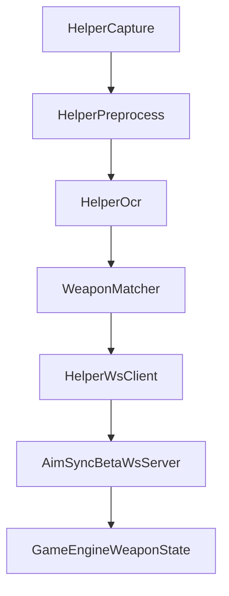

# AimSync Beta Release: OCR Helper

This beta release introduces a new dual-process OCR workflow for AimSync Beta.

The goal is to move game-state reading into a separate helper process and stream the detected weapon back into the main AimSync Beta app in real time.

## What is new

### OCR Helper flow

AimSync Beta now supports an OCR-based helper architecture:

1. `AimSync Beta` runs the main recoil engine and web UI.
2. A separate `helper` process runs screen-region capture and OCR.
3. The helper sends weapon updates to AimSync Beta over WebSocket.
4. AimSync Beta updates the active Game Engine weapon when a valid detection is received.

This is currently designed around **CS2-first** weapon reading.

### Beta-only features

The following features are currently beta-only:

- OCR Helper UI and settings
- OCR helper WebSocket transport
- ROI-based capture configuration
- OCR weapon matching
- Custom hotkeys:
  - global toggle hotkey
  - weapon cycle hotkey
  - direct weapon binds

The stable app remains isolated and keeps the previous known-good behavior.

## Components

### Main app

The main beta app is responsible for:

- hosting the normal AimSync UI
- receiving OCR helper connections
- validating OCR events
- updating the active weapon in the Game Engine

Relevant runtime pieces:

- `main.py`
- `Server/app.py`
- `Server/ocr_ws_server.py`
- `Server/ocr_state.py`

### Helper app

The helper is a separate process under:

- `AI/HelperApp/main.py`
- `AI/HelperApp/ws_client.py`
- `AI/HelperApp/OCR/cs2_reader.py`
- `AI/HelperApp/OCR/preprocess.py`
- `AI/HelperApp/OCR/weapon_matcher.py`

Its responsibilities are:

- capture a configured screen region
- preprocess that region for OCR
- read weapon text through OCR
- normalize/match the detected text to AimSync weapon ids
- send `weapon_detected` or `heartbeat` events back to AimSync Beta

## How the OCR flow works



## Current transport contract

The helper sends WebSocket JSON events such as:

- `heartbeat`
- `weapon_detected`

Typical `weapon_detected` payload:

```json
{
  "type": "weapon_detected",
  "game": "cs2",
  "weapon": "ak47",
  "confidence": 0.84,
  "ts": 1717330000000
}
```

AimSync Beta currently:

- ignores stale events
- ignores low-confidence detections
- keeps the last valid helper state for a short freshness window
- updates the configured weapon only when the match is valid

## Setup flow

### Run the beta app

Use:

```bat
run_beta.bat
```

### Run the helper

Use:

```bat
run_helper.bat
```

### Configure OCR settings

In the beta UI:

1. Open `Game Engine`
2. Enable `OCR Helper`
3. Confirm the auto-filled `Helper Endpoint`
4. Set:
   - confidence threshold
   - poll interval
   - ROI X / Y / Width / Height
5. Save OCR settings

## Important note about ROI

OCR detections depend heavily on the selected ROI.

If the ROI is not configured correctly:

- the helper will still run
- heartbeats may still be sent
- but no valid weapon detections will be produced

At the moment, ROI is configured manually through numeric fields in the beta UI.

## OCR backend behavior

The current helper implementation is designed to use `EasyOCR`.

If the OCR dependency is missing:

- the helper should still stay alive
- connection/heartbeat behavior can still function
- but OCR detections will not be produced

## Current limitations

This is a beta feature set and should be treated as experimental.

Known limitations:

- CS2-first implementation
- manual ROI setup
- OCR accuracy depends on HUD style, scaling, brightness, and capture region quality
- no visual ROI picker yet
- no raw OCR debug panel in the UI yet
- helper and OCR pipeline still need more field-testing on real gameplay overlays

## Why this is in beta

OCR and helper transport touch several unstable areas at once:

- screen capture reliability
- OCR accuracy
- real-time event filtering
- network transport stability
- UI/config workflow

Keeping this in `AimSync Beta` allows:

- isolated config/state from stable AimSync
- faster iteration on OCR and helper behavior
- reduced risk to users who only want the existing stable workflow

## Recommended tester expectations

During beta testing, expect to verify:

- helper connection status
- helper reconnect behavior
- OCR confidence thresholds
- whether the ROI correctly isolates the on-screen weapon label
- whether the matched weapon changes correctly in Game Engine

This release should be treated as a functional beta channel for OCR/helper infrastructure, not as a final polished OCR product.
