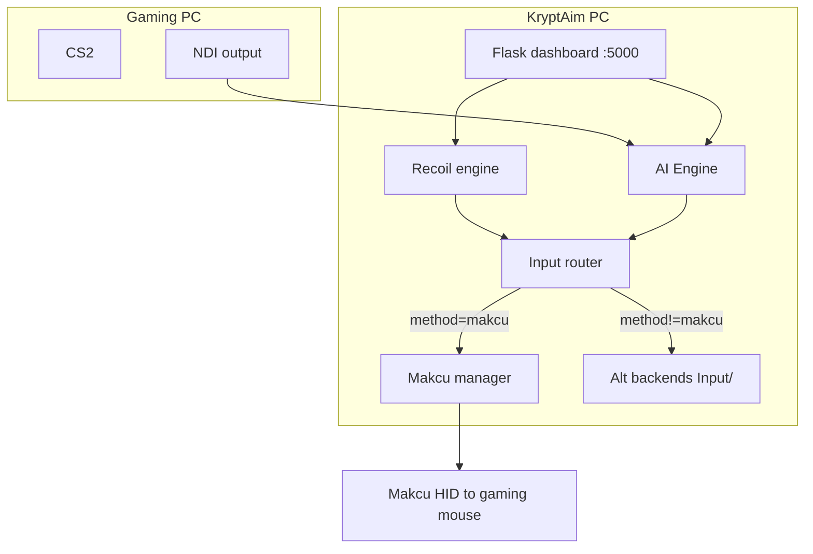

# Roadmap — unified plan (June 2026)

Single source of truth for KryptAim. Merges: Aimmy integration, AI engine migration, Pattern Generator, performance phases, build/distribution, and backlog ideas.

**Last updated:** 2026-06-08

---

## Where we are now

```text
[████████████████████░░░░]  ~80% core product complete
```

### Test feedback (2026-06-08)

| Issue | Status | Notes |
|-------|--------|-------|
| Aim offset (NDI crosshair wrong) | **Fixed** | Uses stream crosshair, not KryptAim PC screen center |
| Player class inverted (CT shoots CT) | **Fixed** | **My team (ignore)** — CT selected → shoots T |
| Debug preview low FPS | **Improved** | OpenCV window no longer capped at 10 FPS; raw BGR path |
| Pattern Generator not laser-accurate | **Open** | Phase 5 — GIF→pattern tuning; G Hub `.lua` import ideal |
| 3 GB exe distribution | **Fixed** | Lite exe (~100 MB) + AppData AI bootstrap; full exe optional |

| Area | Status | Notes |
|------|--------|-------|
| Recoil (Simple / Lab / CS2) | **Done** | Tab mode switching fixed; Makcu + safety features |
| Pattern Generator | **Done** | Embedded + standalone, append to game files |
| AI Engine (dual-PC) | **Done** | NDI capture, CUDA Ultralytics, aim/trigger, profiles |
| PyInstaller exe | **Done** | matplotlib bundled; CUDA torch in build-venv; onedir `dist/KryptAim/` |
| Alt input methods (Phase 0) | **Done** | Win32, G Hub, Arduino, KMBOX Net, Razer — Makcu untouched |
| Sunone AI perf (Phase 1–3) | **Next** | Trigger-only preset, fast path, async pipeline, TensorRT polish |
| OCR weapon helper | **Cancelled** | Removed from codebase; weapon select via UI / hotkeys |
| Beta / stable split | **Retired** | One unified KryptAim channel + `%APPDATA%\KryptAim` |

**You are here:** Product is **usable end-to-end** (venv + exe). Next meaningful work is **AI performance & UX polish** (Phase 1), not new core plumbing.

---

## Shipped (production-ready)

### Recoil & patterns

- [x] Simple recoil sliders
- [x] Recoil Lab editor + cloud share
- [x] CS2 Game Engine (per-weapon patterns, sensitivity scaling)
- [x] Pattern Generator (GIF/image → weapon data, backup on append)
- [x] Global hotkeys + safety randomization
- [x] Recoil mode persists when switching tabs (no auto CS2 override)

### AI Engine

- [x] YOLO detection (`.onnx`, `.pt`, `.engine`)
- [x] CUDA Ultralytics backend + ONNX Runtime GPU fallback
- [x] NDI capture for dual-PC; MSS for local/single-PC
- [x] Target selection, class filters, player/head offsets
- [x] Aim assist: normal / bezier / silent / windmouse smooth
- [x] Auto trigger: radius, confidence, cooldown, linger
- [x] `.cfg` profiles + quickstart API
- [x] Debug preview, readiness checks, button mask (Makcu)
- [x] Shared Makcu with recoil (thread-safe multiplexer)

### Input & hardware

- [x] Makcu HID (primary — dual-PC path)
- [x] Alt input router (`Input/`) — **does not modify** `Makcu/makcu_manager.py`
- [x] Methods: Win32, G Hub, Arduino, Teensy 4.1, RP2350, KMBOX Net, Razer
- [x] Legacy `recoil_input_method` mapping (hardware→makcu, software→win32)

### Distribution & build

- [x] Venv path: `install_kryptaim_pc.bat` + `run_aimsync.bat`
- [x] Build path: `create_build_venv.bat` → `build_app.bat` → `dist/KryptAim/`
- [x] Build repair: `repair_build_venv.bat` (CUDA torch force-reinstall)
- [x] Runtime repair: `repair_ai_deps.bat` (kryptaim-venv)
- [x] PyInstaller bundles: torch, ultralytics, matplotlib, cyndilib, makcu, onnxruntime-gpu
- [x] **Lite exe** (`build_app.bat`) — recoil/UI only; AI via AppData runtime
- [x] **Embeddable Python bootstrap** — no system Python on target PC for AI install
- [x] Wiki docs (replaces old `docs/` tree)

---

## Active roadmap

### Phase 1 — AI quick wins (Sunone-inspired) · **NEXT**

| Item | Goal | Status |
|------|------|--------|
| Trigger-only preset | Aim off, auto-trigger on, tuned radius/delay in UI quickstart | Pending |
| Engine fast path | Skip aim/movement/prediction when aim assist disabled | Pending |
| Latency metrics | NDI grab ms, inference ms, trigger fire latency in debug status | Pending |

**Why first:** Low risk, measurable FPS/latency gains, no architecture change.

---

### Phase 2 — Threaded pipeline

| Item | Goal | Status |
|------|------|--------|
| Async capture thread | Producer frame queue (dual-thread pattern) | Pending |
| Async inference thread | Decouple capture from YOLO + aim/trigger | Pending |
| Smooth move queue | Dedicated movement thread for windmouse/bezier | Partial (movement module exists, not fully async) |

**Reference:** separate capture thread → frame queue → detection loop.

---

### Phase 3 — Detection & GPU polish

| Item | Goal | Status |
|------|------|--------|
| Circle FOV filter | Circular detection mask vs square crop | Pending |
| TensorRT `.engine` workflow | Verify load path, export docs, TRT availability in status | Partial (`.engine` loads; export/docs incomplete) |
| Kalman / delay compensation | Prediction for network + inference lag | Pending |

---

### Phase 5 — Pattern Generator accuracy · **OPEN**

| Item | Goal | Status |
|------|------|--------|
| Spray GIF calibration | Match in-game recoil 1:1 per weapon/sens | Open |
| G Hub `.lua` import | Parse Logitech scripts → weapon data directly | Planned (ideal) |
| Reference weapon scaling | Better famas/AK/M4 cross-weapon tuning | Partial |

### Phase 6 — Distribution size · **DONE (core)**

| Item | Goal | Status |
|------|------|--------|
| Venv zip as dev ship | Source + `install_kryptaim_pc.bat` | Available |
| Slim exe + AppData AI | `build_app.bat` + embeddable Python bootstrap | **Done** |
| Full offline exe | `build_app_full.bat` — all AI bundled | **Done** |
| Onefile exe | Optional single `.exe` (slow start) | Low priority |

---

### Phase 4 — Product & platform

| Item | Goal | Status |
|------|------|--------|
| Improved humanization tuning | Bézier / windmouse parameter presets | Planned |
| Expanded game profiles | Beyond CS2 weapon files | Planned |
| Licensing / premium gates | Hooks exist in cloud layer | Planned |
| Community pattern discovery | Cloud pattern improvements | Planned |
| Onefile exe | Optional single `.exe` (slow start, fragile with torch) | Optional / low priority |
| KMBOX A backend | HID pidvid path (UI + factory stub exist) | Stub only |

---

## Completed plans (archived)

These Cursor plans are **done** — kept for history only.

| Plan | Outcome |
|------|---------|
| **Aimmy Makcu Integration** | AI engine in unified KryptAim; trigger + aim + models UI |
| **AI engine migration** | NDI, Ultralytics, movement modes, hybrid inference — merged into `AI/Engine/` |
| **Pattern Generator v1** | Full embedded + standalone tool |

---

## Cancelled / deprecated

| Plan | Reason |
|------|--------|
| **CS2 OCR Helper (WebSocket)** | Helper app removed; dual-PC weapon switching via dashboard/hotkeys |
| **PrismTB-Makcu port** | HSV + bettercam not suitable for CS2 dual-PC YOLO pipeline |
| **Beta vs stable channel** | Unified release; `is_beta_channel()` guards removed |
| **Aimmy GitHub model store as default** | Local `bin/models/` + user `.onnx`/`.pt`/`.engine` |

---

## Related projects (separate repos — not KryptAim core)

From **CS2 Project Ideas** plan — reuse webradar stack, not blocking KryptAim:

| Tier | Idea | Effort |
|------|------|--------|
| 1 | Finish in-game overlay (WIP) | 1–3 weeks |
| 1 | OBS browser source `/stream` | 1–3 weeks |
| 1 | Mobile PWA polish | 1–3 weeks |
| 2 | Team coach dashboard, Discord bot, grenade lineups | 1–2 months |
| 3 | Demo analyzer, server admin panel | 2+ months |

Pick 1–2 when KryptAim Phase 1–2 are stable.

---

## Architecture snapshot (today)



**Dual-PC rule:** Makcu remains the only path that moves the **gaming PC mouse**. Alt methods move locally on the KryptAim PC.

---

## Scripts cheat sheet

| Script | When |
|--------|------|
| `run_aimsync.bat` | Daily use (venv) |
| `run_dev.bat` | Development |
| `install_kryptaim_pc.bat` | First-time KryptAim PC setup |
| `create_build_venv.bat` | Build machine — create/refresh build venv |
| `repair_build_venv.bat` | Fix CPU torch in build-venv |
| `build_app.bat` | Build `dist/KryptAim/` exe |
| `build_debug.bat` | Exe with console for errors |
| `repair_ai_deps.bat` | Fix CUDA torch in kryptaim-venv |
| `stop_all.bat` | Kill running processes |
| `verify_build_ai_stack.py` | Pre-build AI dependency check |

---

## Suggested order of work

1. **Phase 1** — trigger preset + fast path + latency metrics *(1–2 sessions)*
2. **Phase 2** — async capture/inference *(larger refactor)*
3. **Phase 3** — circle FOV + TensorRT docs/export
4. **Phase 4** — games, licensing, community features

---

## Support development

[Ko-fi](https://ko-fi.com/kava4) · [GitHub Discussions](https://github.com/Kava4/KryptAim/discussions)
