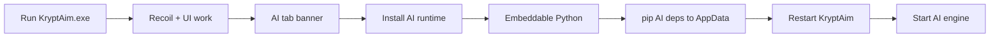

# Slim exe distribution

Ship a **small** `KryptAim.exe` (~50–120 MB) with recoil + UI bundled. The AI stack installs on first use into AppData — **no system Python required**.

---

## Two build profiles

| Profile | Script | Download size | AI stack |
|---------|--------|---------------|----------|
| **lite** (default) | `scripts\build_app.bat` | ~50–120 MB | First-run install to AppData |
| **full** | `scripts\build_app_full.bat` | ~2–4 GB | Everything bundled offline |

Maintainer build (lite):

```bat
scripts\create_build_venv.bat
scripts\build_app.bat
scripts\package_release.bat
```

Output: `dist\KryptAim.exe` — **single file**, no `_internal` folder (PyInstaller onefile).

---

## End-user flow (lite exe)



1. Download `KryptAim.zip` from [Releases](https://github.com/Kava4/KryptAim/releases) and extract `KryptAim.exe` anywhere.
2. Run it — recoil and dashboard work immediately.
3. Open **Global Settings** → **AI Runtime** → click **Install AI runtime**.
4. Wait 10–20 minutes (internet required). Checklist turns green when each step completes. Downloads:
   - Python 3.12 embeddable zip from python.org
   - `get-pip.py` + pip packages from PyPI
   - Optional CUDA PyTorch wheels
5. **Restart KryptAim** when install finishes.
6. Configure NDI, model, and **Start AI engine**.

---

## AppData layout after install

```
%APPDATA%\KryptAim\
├── config.json
├── bin\models\          ← your YOLO weights
├── aimsync.log
└── runtime\
    ├── embed\           ← embeddable Python (~25 MB)
    ├── venv\            ← AI stack (~2 GB)
    └── .ready           ← install complete marker
```

Embeddable Python is configured automatically (`python*._pth`, pip, virtualenv). If embed setup fails, the installer falls back to system `py -3.12` / `python` when available.

---

## vs venv zip vs full exe

| | Slim exe (lite) | Venv zip | Full exe |
|---|-----------------|----------|----------|
| Initial download | Small | Small | Large (~GB) |
| System Python | **Not required** | Required | Not required |
| First AI use | One-click install | `install_kryptaim_pc.bat` | Ready |
| Internet | Needed once for AI | Needed once | Optional |
| Updates | Re-run install or repair | `pip install -U` | Rebuild exe |

---

## API (bootstrap)

| Endpoint | Method | Purpose |
|----------|--------|---------|
| `/api/bootstrap/status` | GET | `needs_bootstrap`, `embed_ready`, `runtime_ready` |
| `/api/bootstrap/install` | POST | Start background install (`{ "cuda": true }`) |

---

## Troubleshooting

| Symptom | Fix |
|---------|-----|
| AI banner stays after install | Restart `KryptAim.exe` |
| Install failed / timeout | Check internet; delete `%APPDATA%\KryptAim\runtime` and retry |
| CUDA torch failed | CPU ONNX may still work; install NVIDIA driver + retry |
| Embed download blocked | Allow python.org + pypi.org in firewall |

Logs: `%APPDATA%\KryptAim\aimsync.log`

---

## Related

- [Installation](Installation)
- [Venv distribution](Venv-Distribution)
- [AI Engine](AI-Engine)
- [Troubleshooting](Troubleshooting)
